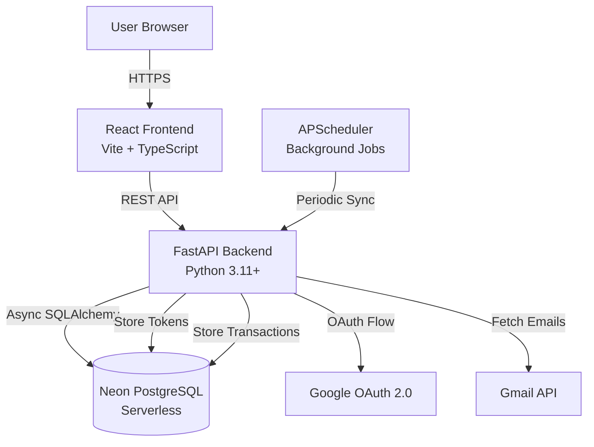

# Design Document: Gmail AI Expense Tracker

## Overview

The Gmail AI Expense Tracker is a full-stack web application that automates expense tracking by analyzing Gmail transaction emails. The system consists of three main components:

1. **Backend API** (FastAPI): Handles authentication, Gmail integration, email parsing, and data management
2. **Frontend Dashboard** (React + TypeScript): Provides user interface for viewing analytics and managing transactions
3. **Database** (Neon PostgreSQL): Stores user data, transactions, and sync logs with serverless scalability

The architecture follows a clean separation of concerns with async/await patterns throughout for optimal performance. The system uses Google OAuth 2.0 for authentication, Gmail API for email access, and APScheduler for automated synchronization every 15 minutes.

### Key Design Principles

- **Async-First**: All I/O operations use async/await for non-blocking execution
- **Security by Default**: Encryption for sensitive data, HTTPOnly cookies, CORS protection
- **Idempotency**: Gmail message IDs prevent duplicate transaction processing
- **Extensibility**: Email parser designed for easy addition of new bank formats and ML integration
- **Serverless-Ready**: Optimized for Neon's serverless PostgreSQL with connection pooling

## Architecture

### System Architecture Diagram



### Technology Stack

**Backend:**
- FastAPI 0.104+ (async web framework)
- SQLAlchemy 2.0+ (async ORM)
- asyncpg (PostgreSQL async driver)
- Pydantic v2 (data validation)
- APScheduler 3.10+ (job scheduling)
- google-auth + google-api-python-client (Gmail API)
- cryptography (Fernet encryption)
- python-jose (JWT handling)
- Alembic (database migrations)

**Frontend:**
- React 18+ with TypeScript
- Vite (build tool)
- Tailwind CSS (styling)
- Axios (HTTP client)
- Recharts (data visualization)
- React Router v6 (routing)
- date-fns (date manipulation)

**Infrastructure:**
- Neon PostgreSQL (serverless database)
- Render/Railway (backend hosting)
- Vercel/Netlify (frontend hosting)
- Google Cloud Platform (OAuth + Gmail API)

### Request Flow

1. **Authentication Flow:**
   - User clicks "Login with Google" → Frontend redirects to Backend /auth/google
   - Backend redirects to Google OAuth consent screen
   - User approves → Google redirects to Backend callback with code
   - Backend exchanges code for tokens, encrypts refresh token, stores in DB
   - Backend generates JWT session token, sets HTTPOnly cookie
   - Backend redirects to Frontend dashboard

2. **Transaction Fetch Flow:**
   - Scheduler triggers every 15 minutes
   - For each active user: refresh access token → query Gmail API
   - Filter emails by search query → check message IDs against DB
   - Parse new emails → extract transaction data
   - Insert transactions into DB → log sync results

3. **Dashboard Data Flow:**
   - Frontend requests /analytics/summary with JWT cookie
   - Backend validates JWT → queries transactions from DB
   - Aggregates data (total spent, monthly breakdown, categories)
   - Returns JSON response → Frontend renders charts

## Components and Interfaces

### Backend Components

#### 1. Authentication Module (`app/auth/`)

**Purpose:** Handle Google OAuth 2.0 flow and session management

**Files:**
- `oauth.py`: OAuth flow implementation
- `jwt_handler.py`: JWT token generation and validation
- `encryption.py`: Refresh token encryption/decryption

**Key Functions:**

```python
# oauth.py
async def initiate_oauth_flow() -> str:
    """Generate OAuth authorization URL with required scopes"""
    
async def handle_oauth_callback(code: str) -> dict:
    """Exchange authorization code for tokens"""
    
async def refresh_access_token(refresh_token: str) -> str:
    """Obtain new access token using refresh token"""

# jwt_handler.py
def create_session_token(user_id: str, email: str) -> str:
    """Generate JWT session token"""
    
def verify_session_token(token: str) -> dict:
    """Validate and decode JWT token"""

# encryption.py
def encrypt_refresh_token(token: str) -> str:
    """Encrypt refresh token using Fernet"""
    
def decrypt_refresh_token(encrypted: str) -> str:
    """Decrypt refresh token"""
```

**Dependencies:** google-auth, google-auth-oauthlib, python-jose, cryptography

#### 2. Gmail Service (`app/services/gmail_service.py`)

**Purpose:** Interface with Gmail API to fetch transaction emails

**Key Functions:**

```python
async def fetch_transaction_emails(
    access_token: str,
    last_sync_time: datetime | None = None
) -> list[dict]:
    """
    Fetch emails matching transaction query
    Returns list of {message_id, subject, body, date}
    """
    
async def get_email_content(access_token: str, message_id: str) -> dict:
    """Fetch full email content for a specific message ID"""
```

**Search Query:** `("INR" OR "Rs" OR "debited" OR "credited")`

**API Calls:**
- `users.messages.list()` with query parameter
- `users.messages.get()` with format='full'

#### 3. Email Parser (`app/services/email_parser.py`)

**Purpose:** Extract transaction details from email content using regex patterns

**Data Structure:**

```python
from pydantic import BaseModel
from enum import Enum
from decimal import Decimal

class TransactionType(str, Enum):
    DEBIT = "debit"
    CREDIT = "credit"

class ParsedTransaction(BaseModel):
    amount: Decimal
    currency: str = "INR"
    transaction_type: TransactionType
    merchant: str | None
    transaction_date: datetime
    bank_name: str | None
```

**Key Functions:**

```python
def parse_email(subject: str, body: str) -> ParsedTransaction | None:
    """
    Parse email content to extract transaction details
    Returns None if parsing fails
    """
    
def extract_amount(text: str) -> Decimal | None:
    """Extract amount using regex patterns"""
    
def extract_transaction_type(text: str) -> TransactionType | None:
    """Identify debit or credit transaction"""
    
def extract_merchant(text: str) -> str | None:
    """Extract merchant name"""
    
def extract_date(text: str) -> datetime | None:
    """Extract transaction date"""
    
def extract_bank(text: str) -> str | None:
    """Identify bank from email sender or content"""
```

**Regex Patterns (Indian Banks):**

```python
AMOUNT_PATTERNS = [
    r'(?:INR|Rs\.?)\s*(\d+(?:,\d+)*(?:\.\d{2})?)',
    r'(?:amount|Amount|AMOUNT):\s*(?:INR|Rs\.?)?\s*(\d+(?:,\d+)*(?:\.\d{2})?)',
]

DEBIT_KEYWORDS = ['debited', 'debit', 'spent', 'withdrawn', 'paid']
CREDIT_KEYWORDS = ['credited', 'credit', 'received', 'deposited']

MERCHANT_PATTERNS = [
    r'(?:at|to|from)\s+([A-Z][A-Za-z0-9\s&\-\.]+?)(?:\s+on|\s+dated)',
    r'(?:merchant|Merchant):\s*([A-Za-z0-9\s&\-\.]+)',
]

DATE_PATTERNS = [
    r'(\d{2}-\d{2}-\d{4})',
    r'(\d{2}/\d{2}/\d{4})',
    r'on\s+(\d{2}\s+[A-Za-z]+\s+\d{4})',
]
```

**Date Handling:**
- All datetime objects use timezone-aware UTC timestamps
- `extract_date()` returns `None` if no valid date found (no fallback to current date)
- Dates are parsed and immediately converted to UTC
- Invalid or missing dates cause the entire email parse to fail (return None)

**Extensibility Design:**
- Parser returns structured `ParsedTransaction` object
- Easy to add new regex patterns for additional banks
- Future: Replace regex with ML model that returns same `ParsedTransaction` structure

#### 4. Database Module (`app/database.py`, `app/models/`)

**Purpose:** Async database connection and ORM models

**Database Configuration:**

```python
# database.py
from sqlalchemy.ext.asyncio import create_async_engine, AsyncSession, async_sessionmaker
from sqlalchemy.orm import declarative_base

DATABASE_URL = os.getenv("DATABASE_URL")
# Neon requires SSL
if DATABASE_URL and not DATABASE_URL.startswith("postgresql+asyncpg"):
    DATABASE_URL = DATABASE_URL.replace("postgresql://", "postgresql+asyncpg://")

engine = create_async_engine(
    DATABASE_URL,
    echo=False,
    pool_size=10,
    max_overflow=20,
    pool_pre_ping=True,  # Handle Neon idle timeout
    pool_recycle=3600,   # Recycle connections every hour
)

AsyncSessionLocal = async_sessionmaker(
    engine,
    class_=AsyncSession,
    expire_on_commit=False
)

Base = declarative_base()

async def get_db() -> AsyncSession:
    """Dependency for FastAPI routes"""
    async with AsyncSessionLocal() as session:
        yield session
```

**Models:**

```python
# app/models/user.py
from sqlalchemy import Column, String, DateTime
from sqlalchemy.dialects.postgresql import UUID
from datetime import datetime, timezone
import uuid

class User(Base):
    __tablename__ = "users"
    
    id = Column(UUID(as_uuid=True), primary_key=True, default=uuid.uuid4)
    email = Column(String, unique=True, nullable=False, index=True)
    name = Column(String, nullable=False)
    google_id = Column(String, unique=True, nullable=False)
    refresh_token_encrypted = Column(String, nullable=False)
    created_at = Column(DateTime(timezone=True), default=lambda: datetime.now(timezone.utc))

# app/models/transaction.py
from sqlalchemy import Column, String, Numeric, DateTime, Enum, ForeignKey
from sqlalchemy.dialects.postgresql import UUID
from datetime import datetime, timezone
import enum

class TransactionTypeEnum(str, enum.Enum):
    DEBIT = "debit"
    CREDIT = "credit"

class Transaction(Base):
    __tablename__ = "transactions"
    
    id = Column(UUID(as_uuid=True), primary_key=True, default=uuid.uuid4)
    user_id = Column(UUID(as_uuid=True), ForeignKey("users.id"), nullable=False, index=True)
    amount = Column(Numeric(10, 2), nullable=False)
    currency = Column(String, default="INR")
    transaction_type = Column(Enum(TransactionTypeEnum), nullable=False)
    merchant = Column(String, nullable=True)
    transaction_date = Column(DateTime(timezone=True), nullable=False)  # Timezone-aware
    bank_name = Column(String, nullable=True)
    gmail_message_id = Column(String, unique=True, nullable=False)
    created_at = Column(DateTime(timezone=True), default=lambda: datetime.now(timezone.utc))

# app/models/sync_log.py
class SyncLog(Base):
    __tablename__ = "sync_logs"
    
    id = Column(UUID(as_uuid=True), primary_key=True, default=uuid.uuid4)
    user_id = Column(UUID(as_uuid=True), ForeignKey("users.id"), nullable=False, index=True)
    status = Column(String, nullable=False)  # success, partial, failed
    emails_processed = Column(Integer, default=0)
    errors = Column(String, nullable=True)
    created_at = Column(DateTime(timezone=True), default=lambda: datetime.now(timezone.utc))
```

**Date/Time Handling:**
- All DateTime columns use `timezone=True` for timezone-aware storage
- Default values use `datetime.now(timezone.utc)` for consistent UTC timestamps
- No mixing of naive and aware datetime objects

#### 5. Scheduler Module (`app/scheduler/sync_job.py`)

**Purpose:** Automated periodic email synchronization

**Implementation:**

```python
from apscheduler.schedulers.asyncio import AsyncIOScheduler
from apscheduler.triggers.interval import IntervalTrigger

scheduler = AsyncIOScheduler()

async def sync_all_users():
    """Main sync job that processes all active users"""
    async with AsyncSessionLocal() as session:
        # Fetch all users
        result = await session.execute(select(User))
        users = result.scalars().all()
        
        for user in users:
            try:
                await sync_user_emails(user, session)
            except Exception as e:
                logger.error(f"Sync failed for user {user.id}: {e}")
                await log_sync_failure(user.id, str(e), session)
            finally:
                await session.commit()

async def sync_user_emails(user: User, session: AsyncSession):
    """Sync emails for a single user"""
    # 1. Decrypt and refresh access token
    refresh_token = decrypt_refresh_token(user.refresh_token_encrypted)
    access_token = await refresh_access_token(refresh_token)
    
    # 2. Fetch new emails from Gmail
    emails = await fetch_transaction_emails(access_token)
    
    # 3. Filter out already processed message IDs
    existing_ids = await get_processed_message_ids(user.id, session)
    new_emails = [e for e in emails if e['message_id'] not in existing_ids]
    
    # 4. Parse and insert transactions
    transactions_added = 0
    for email in new_emails:
        parsed = parse_email(email['subject'], email['body'])
        if parsed:
            transaction = Transaction(
                user_id=user.id,
                amount=parsed.amount,
                currency=parsed.currency,
                transaction_type=parsed.transaction_type,
                merchant=parsed.merchant,
                transaction_date=parsed.transaction_date,
                bank_name=parsed.bank_name,
                gmail_message_id=email['message_id']
            )
            session.add(transaction)
            transactions_added += 1
    
    # 5. Log sync results
    sync_log = SyncLog(
        user_id=user.id,
        status="success",
        emails_processed=transactions_added
    )
    session.add(sync_log)

def start_scheduler():
    """Initialize and start the scheduler"""
    scheduler.add_job(
        sync_all_users,
        trigger=IntervalTrigger(minutes=15),
        id='sync_all_users',
        replace_existing=True
    )
    scheduler.start()
```

**Connection Management:**
- Use short-lived sessions within each job
- Explicitly close sessions after processing each user
- Handle Neon idle timeout with `pool_pre_ping=True`

#### 6. API Routes (`app/routes/`)

**Authentication Routes (`auth.py`):**

```python
@router.get("/auth/google")
async def google_auth():
    """Initiate OAuth flow"""
    
@router.get("/auth/callback")
async def google_callback(code: str):
    """Handle OAuth callback, set session cookie"""
    
@router.get("/auth/me")
async def get_current_user(token: str = Depends(verify_token)):
    """Get current user info"""
    
@router.post("/auth/logout")
async def logout(response: Response):
    """Clear session cookie"""
```

**Transaction Routes (`transactions.py`):**

```python
@router.get("/transactions")
async def get_transactions(
    skip: int = 0,
    limit: int = 50,
    transaction_type: str | None = None,
    start_date: datetime | None = None,
    end_date: datetime | None = None,
    db: AsyncSession = Depends(get_db),
    current_user: User = Depends(get_current_user)
):
    """Get paginated transactions with filters"""
    
@router.get("/transactions/export")
async def export_transactions_csv(
    current_user: User = Depends(get_current_user),
    db: AsyncSession = Depends(get_db)
):
    """Export transactions as CSV"""
```

**Analytics Routes (`analytics.py`):**

```python
@router.get("/analytics/summary")
async def get_summary(
    current_user: User = Depends(get_current_user),
    db: AsyncSession = Depends(get_db)
):
    """Get total spent, transaction count, etc."""
    
@router.get("/analytics/monthly")
async def get_monthly_data(
    months: int = 6,
    current_user: User = Depends(get_current_user),
    db: AsyncSession = Depends(get_db)
):
    """Get monthly spending breakdown"""
    
@router.get("/analytics/categories")
async def get_category_breakdown(
    current_user: User = Depends(get_current_user),
    db: AsyncSession = Depends(get_db)
):
    """Get spending by merchant/category"""
```

**Sync Routes (`sync.py`):**

```python
@router.post("/sync/manual")
async def trigger_manual_sync(
    current_user: User = Depends(get_current_user),
    db: AsyncSession = Depends(get_db)
):
    """Trigger immediate sync for current user"""
    
@router.get("/sync/history")
async def get_sync_history(
    limit: int = 20,
    current_user: User = Depends(get_current_user),
    db: AsyncSession = Depends(get_db)
):
    """Get sync log history"""
```

### Frontend Components

#### 1. Authentication Context (`src/context/AuthContext.tsx`)

**Purpose:** Manage authentication state across the application

```typescript
interface AuthContextType {
  user: User | null;
  loading: boolean;
  login: () => void;
  logout: () => Promise<void>;
  checkAuth: () => Promise<void>;
}

export const AuthProvider: React.FC<{children: React.ReactNode}> = ({children}) => {
  const [user, setUser] = useState<User | null>(null);
  const [loading, setLoading] = useState(true);
  
  const checkAuth = async () => {
    try {
      const response = await axios.get('/auth/me', {withCredentials: true});
      setUser(response.data);
    } catch {
      setUser(null);
    } finally {
      setLoading(false);
    }
  };
  
  useEffect(() => {
    checkAuth();
  }, []);
  
  return (
    <AuthContext.Provider value={{user, loading, login, logout, checkAuth}}>
      {children}
    </AuthContext.Provider>
  );
};
```

#### 2. Dashboard Page (`src/pages/Dashboard.tsx`)

**Components:**
- `SummaryCards`: Display total spent, transaction count, last sync time
- `MonthlyChart`: Line/bar chart showing monthly spending trends
- `CategoryBreakdown`: Pie chart of spending by merchant
- `SyncButton`: Manual sync trigger with loading state
- `ExportButton`: CSV export functionality

**Data Fetching:**

```typescript
const Dashboard: React.FC = () => {
  const [summary, setSummary] = useState<Summary | null>(null);
  const [monthlyData, setMonthlyData] = useState<MonthlyData[]>([]);
  const [categories, setCategories] = useState<CategoryData[]>([]);
  
  useEffect(() => {
    fetchDashboardData();
  }, []);
  
  const fetchDashboardData = async () => {
    const [summaryRes, monthlyRes, categoriesRes] = await Promise.all([
      axios.get('/analytics/summary'),
      axios.get('/analytics/monthly'),
      axios.get('/analytics/categories')
    ]);
    setSummary(summaryRes.data);
    setMonthlyData(monthlyRes.data);
    setCategories(categoriesRes.data);
  };
  
  return (
    <div className="dashboard">
      <SummaryCards data={summary} />
      <MonthlyChart data={monthlyData} />
      <CategoryBreakdown data={categories} />
    </div>
  );
};
```

#### 3. Transactions Page (`src/pages/Transactions.tsx`)

**Features:**
- Paginated transaction table
- Filters: date range, transaction type, merchant search
- Sort by date, amount
- Responsive design

```typescript
const Transactions: React.FC = () => {
  const [transactions, setTransactions] = useState<Transaction[]>([]);
  const [filters, setFilters] = useState<Filters>({});
  const [page, setPage] = useState(0);
  
  useEffect(() => {
    fetchTransactions();
  }, [filters, page]);
  
  const fetchTransactions = async () => {
    const params = {
      skip: page * 50,
      limit: 50,
      ...filters
    };
    const response = await axios.get('/transactions', {params});
    setTransactions(response.data);
  };
  
  return (
    <div className="transactions-page">
      <FilterBar filters={filters} onChange={setFilters} />
      <TransactionTable data={transactions} />
      <Pagination page={page} onChange={setPage} />
    </div>
  );
};
```

#### 4. Settings Page (`src/pages/Settings.tsx`)

**Features:**
- Sync preferences (enable/disable auto-sync)
- Sync history table
- Account information
- Dark mode toggle

## Data Models

### Database Schema

**Users Table:**
```sql
CREATE TABLE users (
    id UUID PRIMARY KEY DEFAULT gen_random_uuid(),
    email VARCHAR(255) UNIQUE NOT NULL,
    name VARCHAR(255) NOT NULL,
    google_id VARCHAR(255) UNIQUE NOT NULL,
    refresh_token_encrypted TEXT NOT NULL,
    created_at TIMESTAMP DEFAULT CURRENT_TIMESTAMP
);

CREATE INDEX idx_users_email ON users(email);
CREATE INDEX idx_users_google_id ON users(google_id);
```

**Transactions Table:**
```sql
CREATE TYPE transaction_type AS ENUM ('debit', 'credit');

CREATE TABLE transactions (
    id UUID PRIMARY KEY DEFAULT gen_random_uuid(),
    user_id UUID NOT NULL REFERENCES users(id) ON DELETE CASCADE,
    amount NUMERIC(10, 2) NOT NULL,
    currency VARCHAR(10) DEFAULT 'INR',
    transaction_type transaction_type NOT NULL,
    merchant VARCHAR(255),
    transaction_date TIMESTAMP NOT NULL,
    bank_name VARCHAR(255),
    gmail_message_id VARCHAR(255) UNIQUE NOT NULL,
    created_at TIMESTAMP DEFAULT CURRENT_TIMESTAMP
);

CREATE INDEX idx_transactions_user_id ON transactions(user_id);
CREATE INDEX idx_transactions_date ON transactions(transaction_date);
CREATE INDEX idx_transactions_message_id ON transactions(gmail_message_id);
```

**Sync Logs Table:**
```sql
CREATE TABLE sync_logs (
    id UUID PRIMARY KEY DEFAULT gen_random_uuid(),
    user_id UUID NOT NULL REFERENCES users(id) ON DELETE CASCADE,
    status VARCHAR(50) NOT NULL,
    emails_processed INTEGER DEFAULT 0,
    errors TEXT,
    created_at TIMESTAMP DEFAULT CURRENT_TIMESTAMP
);

CREATE INDEX idx_sync_logs_user_id ON sync_logs(user_id);
CREATE INDEX idx_sync_logs_created_at ON sync_logs(created_at);
```

### API Data Models (Pydantic Schemas)

```python
# app/schemas/user.py
class UserBase(BaseModel):
    email: str
    name: str

class UserResponse(UserBase):
    id: UUID
    created_at: datetime

# app/schemas/transaction.py
class TransactionBase(BaseModel):
    amount: Decimal
    currency: str
    transaction_type: TransactionType
    merchant: str | None
    transaction_date: datetime
    bank_name: str | None

class TransactionResponse(TransactionBase):
    id: UUID
    created_at: datetime

class TransactionListResponse(BaseModel):
    transactions: list[TransactionResponse]
    total: int
    page: int
    limit: int

# app/schemas/analytics.py
class SummaryResponse(BaseModel):
    total_spent: Decimal
    total_received: Decimal
    transaction_count: int
    last_sync: datetime | None

class MonthlyDataPoint(BaseModel):
    month: str
    spent: Decimal
    received: Decimal

class CategoryDataPoint(BaseModel):
    merchant: str
    amount: Decimal
    percentage: float
```


## Correctness Properties

A property is a characteristic or behavior that should hold true across all valid executions of a system—essentially, a formal statement about what the system should do. Properties serve as the bridge between human-readable specifications and machine-verifiable correctness guarantees.

### Property 1: Gmail Message ID Uniqueness (Idempotency)

*For any* gmail_message_id, attempting to insert a second transaction with the same message ID should fail with a unique constraint violation, ensuring no duplicate transaction processing.

**Validates: Requirements 1.8, 3.3**

### Property 2: OAuth Token Exchange

*For any* valid OAuth authorization code, the token exchange process should return both an access token and a refresh token.

**Validates: Requirements 2.2**

### Property 3: Refresh Token Encryption

*For any* refresh token stored in the database, the stored value should not equal the plaintext token (must be encrypted).

**Validates: Requirements 2.3, 7.1**

### Property 4: Session Token Generation

*For any* successful authentication, a JWT session token should be generated and included in the response as an HTTPOnly secure cookie.

**Validates: Requirements 2.4, 2.5**

### Property 5: Token Refresh on Expiration

*For any* expired access token with a valid refresh token, the system should successfully obtain a new access token without user intervention.

**Validates: Requirements 2.6**

### Property 6: Token Refresh Failure Handling

*For any* failed token refresh attempt (invalid or revoked refresh token), the system should return an authentication error and clear the session cookie.

**Validates: Requirements 2.7**

### Property 7: Duplicate Email Filtering

*For any* sync operation, emails with message IDs that already exist in the transactions table should be skipped and not processed again.

**Validates: Requirements 3.2, 3.3**

### Property 8: Email Content Completeness

*For any* new email fetched from Gmail API, the returned data should include both subject and body fields.

**Validates: Requirements 3.4**

### Property 9: Message ID Persistence

*For any* successfully processed email, the gmail_message_id should exist in the transactions table after processing completes.

**Validates: Requirements 3.5**

### Property 10: Email Parser Completeness

*For any* valid transaction email containing all required patterns (amount, type, date), the parser should successfully extract a complete ParsedTransaction object with all fields populated.

**Validates: Requirements 4.2, 4.3, 4.4, 4.5, 4.6**

### Property 11: Parser Error Handling

*For any* email that lacks required transaction patterns, the parser should return None or an error indicator rather than a partial transaction.

**Validates: Requirements 4.9**

### Property 12: Sync User Processing

*For any* sync job execution, all active users in the database should be fetched and processed.

**Validates: Requirements 5.2**

### Property 13: Sync Transaction Insertion

*For any* successfully parsed transaction during sync, a corresponding transaction record should be inserted into the database with the correct user_id.

**Validates: Requirements 5.6**

### Property 14: Sync Logging

*For any* completed sync operation (success or failure), a sync_log entry should be created with the appropriate status and email count.

**Validates: Requirements 5.7**

### Property 15: Sync Error Isolation

*For any* user whose sync fails, the error should be logged and the sync process should continue processing remaining users without interruption.

**Validates: Requirements 5.10**

### Property 16: CSV Export Format

*For any* set of transactions, the CSV export should generate valid CSV format with headers and all transaction fields properly formatted.

**Validates: Requirements 6.6**

### Property 17: Transaction Pagination

*For any* transaction list request, the response should contain at most the requested limit (maximum 100) of transactions.

**Validates: Requirements 6.8, 12.3**

### Property 18: Transaction Filtering

*For any* filter criteria applied (date range, transaction type, merchant), all returned transactions should match the specified filter conditions.

**Validates: Requirements 6.9**

### Property 19: Client Secret Protection

*For any* API response or frontend code bundle, Google client secrets should never be present in the content.

**Validates: Requirements 7.2**

### Property 20: JWT Validation on Protected Endpoints

*For any* request to a protected endpoint with an invalid or missing JWT token, the system should return a 401 Unauthorized response.

**Validates: Requirements 7.4**

### Property 21: Rate Limiting Enforcement

*For any* endpoint with rate limiting configured, requests exceeding the rate limit should be rejected with a 429 Too Many Requests response.

**Validates: Requirements 7.5**

### Property 22: Input Validation

*For any* API request with invalid input data, the system should return a 422 Unprocessable Entity response with validation error details.

**Validates: Requirements 7.6**

### Property 23: CORS Origin Validation

*For any* request from an unauthorized origin, the system should reject the request or omit CORS headers.

**Validates: Requirements 7.8**

### Property 24: Logout Session Clearing

*For any* logout request, the response should clear the session cookie and subsequent requests with that token should be rejected.

**Validates: Requirements 7.9**

### Property 25: Migration Reversibility

*For any* Alembic migration, both the upgrade and downgrade functions should execute successfully without errors.

**Validates: Requirements 8.4**

### Property 26: Error Response Consistency

*For any* error condition, the API response should include a consistent error format with an appropriate HTTP status code (4xx for client errors, 5xx for server errors).

**Validates: Requirements 9.10**

### Property 27: Environment Variable Validation

*For any* required environment variable that is missing or invalid, the application should fail to start and log a clear error message indicating which variable is missing.

**Validates: Requirements 10.10**

### Property 28: Authentication Logging

*For any* authentication attempt (success or failure), a log entry should be created with the user identifier and outcome.

**Validates: Requirements 11.1**

### Property 29: Error Message User-Friendliness

*For any* error response returned to the client, the error message should be user-friendly (not exposing internal implementation details or stack traces).

**Validates: Requirements 11.5**

### Property 30: Request Correlation

*For any* API request, a correlation ID should be generated and included in all related log entries for that request.

**Validates: Requirements 11.7**

### Property 31: Request Timeout Enforcement

*For any* API request that exceeds the configured timeout limit, the request should be terminated and return a 504 Gateway Timeout response.

**Validates: Requirements 12.7**

### Property 32: Date Extraction Returns None for Missing Dates

*For any* email text that does not contain a valid date pattern, the extract_date function should return None rather than a fallback date.

**Validates: Requirements 4.10, 13.4**

### Property 33: Timezone-Aware Datetime Consistency

*For any* datetime object created or stored by the system, it should be timezone-aware (have tzinfo set to UTC) and not naive.

**Validates: Requirements 13.1, 13.2, 13.5**

## Error Handling

### Error Categories

**1. Authentication Errors:**
- Invalid or expired JWT tokens → 401 Unauthorized
- OAuth flow failures → Redirect to login with error message
- Token refresh failures → Clear session, require re-authentication

**2. Gmail API Errors:**
- Rate limit exceeded → Retry with exponential backoff
- Invalid credentials → Log error, mark user for re-authentication
- Network errors → Retry up to 3 times, then log failure

**3. Parsing Errors:**
- Unable to extract required fields (including date) → Log warning, skip email, return None
- Invalid date format → Return None (no fallback to current date)
- Invalid amount format → Skip transaction, log error
- Missing transaction date → Skip email, log warning

**4. Database Errors:**
- Connection timeout → Retry with new connection
- Unique constraint violation → Log as duplicate, skip insertion
- Foreign key violation → Log error, investigate data integrity

**5. Validation Errors:**
- Invalid request data → Return 422 with detailed validation errors
- Missing required fields → Return 400 Bad Request

### Error Response Format

All API errors follow this consistent format:

```json
{
  "error": {
    "code": "ERROR_CODE",
    "message": "User-friendly error message",
    "details": {
      "field": "Additional context"
    },
    "correlation_id": "uuid"
  }
}
```

### Logging Strategy

**Log Levels:**
- **DEBUG**: Detailed flow information (disabled in production)
- **INFO**: Normal operations (auth success, sync start/complete)
- **WARNING**: Recoverable errors (parsing failures, retries)
- **ERROR**: Serious errors requiring attention (DB errors, API failures)
- **CRITICAL**: System-level failures (startup failures, unrecoverable errors)

**Structured Logging:**

```python
import structlog

logger = structlog.get_logger()

# Example log entries
logger.info("user_authenticated", user_id=user.id, email=user.email)
logger.warning("email_parse_failed", message_id=msg_id, reason="missing_amount")
logger.error("gmail_api_error", user_id=user.id, status_code=429, error=str(e))
```

### Retry Logic

**Gmail API Calls:**
```python
from tenacity import retry, stop_after_attempt, wait_exponential

@retry(
    stop=stop_after_attempt(3),
    wait=wait_exponential(multiplier=1, min=2, max=10)
)
async def fetch_emails_with_retry(access_token: str):
    return await fetch_transaction_emails(access_token)
```

**Database Operations:**
- Use SQLAlchemy's built-in retry on connection errors
- Implement circuit breaker for repeated failures
- Log all retry attempts

## Testing Strategy

### Dual Testing Approach

The testing strategy employs both unit tests and property-based tests to ensure comprehensive coverage:

- **Unit Tests**: Verify specific examples, edge cases, and integration points
- **Property-Based Tests**: Verify universal properties across randomized inputs

Both approaches are complementary and necessary. Unit tests catch concrete bugs and validate specific scenarios, while property-based tests verify general correctness across a wide input space.

### Property-Based Testing Configuration

**Library:** Hypothesis (Python) for backend testing

**Configuration:**
- Minimum 100 iterations per property test
- Each test tagged with feature name and property number
- Tag format: `# Feature: gmail-expense-tracker, Property {N}: {property_text}`

**Example Property Test:**

```python
from hypothesis import given, strategies as st
import pytest

# Feature: gmail-expense-tracker, Property 1: Gmail Message ID Uniqueness
@given(
    message_id=st.text(min_size=10, max_size=50),
    user_id=st.uuids(),
    amount=st.decimals(min_value=0.01, max_value=999999.99, places=2)
)
@pytest.mark.asyncio
async def test_duplicate_message_id_rejected(message_id, user_id, amount, db_session):
    """For any gmail_message_id, inserting duplicate should fail"""
    # Create first transaction
    transaction1 = Transaction(
        user_id=user_id,
        amount=amount,
        currency="INR",
        transaction_type=TransactionType.DEBIT,
        transaction_date=datetime.utcnow(),
        gmail_message_id=message_id
    )
    db_session.add(transaction1)
    await db_session.commit()
    
    # Attempt to create duplicate
    transaction2 = Transaction(
        user_id=user_id,
        amount=amount,
        currency="INR",
        transaction_type=TransactionType.DEBIT,
        transaction_date=datetime.utcnow(),
        gmail_message_id=message_id
    )
    db_session.add(transaction2)
    
    with pytest.raises(IntegrityError):
        await db_session.commit()
```

### Unit Testing Strategy

**Backend Unit Tests:**

1. **Authentication Module:**
   - Test OAuth URL generation with correct scopes
   - Test JWT token creation and validation
   - Test refresh token encryption/decryption
   - Test session cookie attributes (HTTPOnly, Secure)

2. **Email Parser:**
   - Test parsing of sample emails from major Indian banks
   - Test edge cases: missing fields, malformed dates, special characters
   - Test error handling for unparseable emails

3. **Gmail Service:**
   - Mock Gmail API responses
   - Test email fetching with correct query
   - Test error handling for API failures

4. **Database Operations:**
   - Test CRUD operations for all models
   - Test unique constraints and foreign keys
   - Test transaction rollback on errors

5. **API Endpoints:**
   - Test all endpoints with valid and invalid inputs
   - Test authentication middleware
   - Test pagination and filtering
   - Test error responses

**Frontend Unit Tests:**

1. **Components:**
   - Test rendering with various props
   - Test user interactions (button clicks, form submissions)
   - Test conditional rendering

2. **API Integration:**
   - Mock API responses
   - Test error handling
   - Test loading states

3. **Authentication Context:**
   - Test login/logout flows
   - Test token refresh
   - Test protected route access

### Integration Testing

**End-to-End Flows:**

1. **Complete OAuth Flow:**
   - Initiate login → OAuth consent → Callback → Session creation

2. **Email Sync Flow:**
   - Trigger sync → Fetch emails → Parse → Store → Verify in DB

3. **Dashboard Data Flow:**
   - Login → Fetch analytics → Render charts → Export CSV

**Test Environment:**
- Use test Neon database
- Mock Gmail API with recorded responses
- Use test Google OAuth credentials

### Test Coverage Goals

- Backend: Minimum 80% code coverage
- Frontend: Minimum 70% code coverage
- All correctness properties: 100% coverage (all properties must have tests)

### Continuous Integration

**CI Pipeline:**
1. Run linters (flake8, mypy, eslint)
2. Run unit tests
3. Run property-based tests
4. Run integration tests
5. Generate coverage reports
6. Build Docker images
7. Deploy to staging (on main branch)

**Tools:**
- GitHub Actions or GitLab CI
- pytest with pytest-cov for coverage
- Docker for containerized testing
